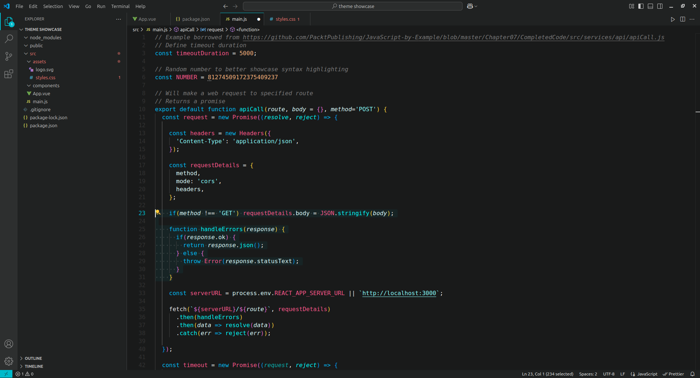
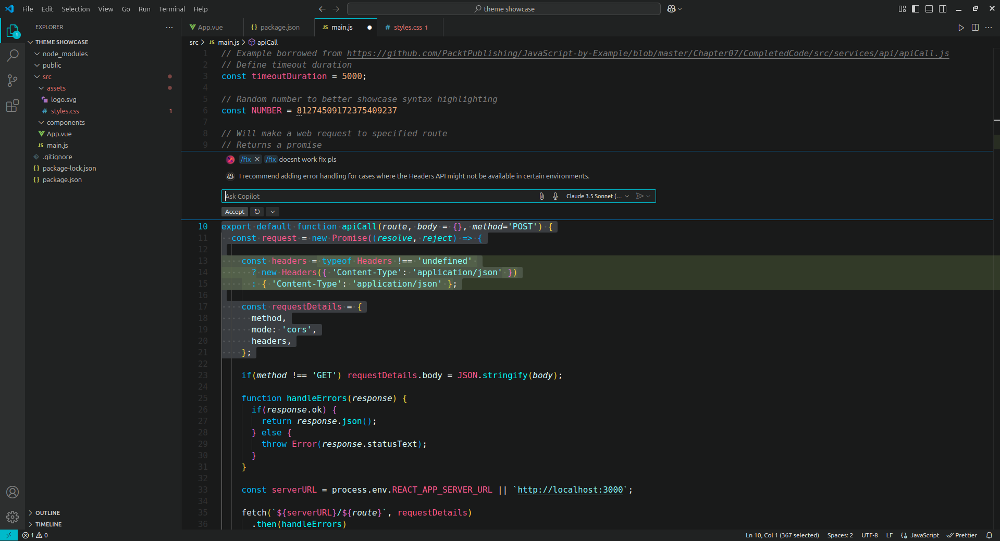
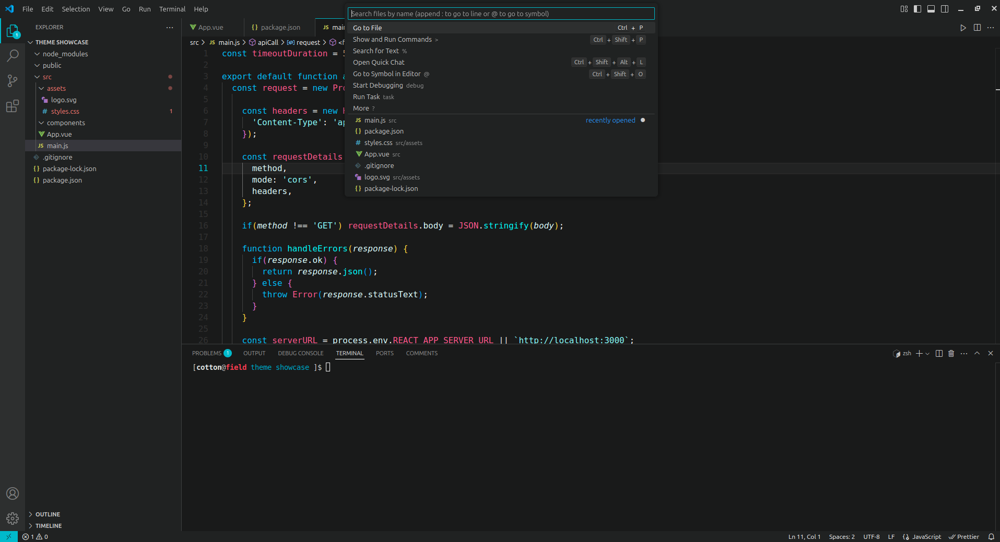

# Perplexity Theme

## Screenshots

## 🚀 Installation
- Open the Extensions sidebar in VSCode
- Search for Perplexity Theme
- Click Install
- Open the Command Palette with Ctrl+Shift+P or ⇧⌘P
- Select Preferences: Color Theme and choose Perplexity.

---

GitHub repository: https://github.com/cottonable/perplexity-vscode

Marketplace link: https://marketplace.visualstudio.com/items?itemName=cottonable.perplexity
